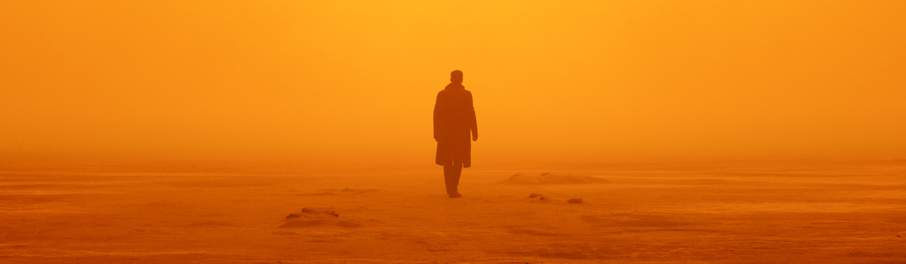

# Hello there, I'm Abdul Samad! 🙋🏽‍♀

## About Me

I'm a *self-taught Front-End Developer* from *Sydney, Australia* who just absolutely LOVES to fix bugs. I just love that level of satisfaction you recieve after spending countless hours tinkering on a bug and finally getting it to work. 

I'd say my desire to learn web development stems from my curious and creative nature. It was through online tutorials and countless hours of self study that I was able to hone my skills in HTML, CSS, JavaScript and React. As I delved deeper into the intricacies of front-end development, I discovered the endless possibilities that come with creating seamless and intuitive user experiences.

- 👩🏽‍💻 *Would love to work!*
- 🌱 *React.js* in progress
- ⚡ Fun fact: I lose track of time when coding 

## My Skill-set

- *Language*: I'm proficient in *JavaScript*, and I can't wait to learn new languages.

- *Frontend Development*: I have a strong foundation in *HTML, CSS, and JavaScript. I'm also proficient in the framework *React* 

- *UI/UX Design*: I have a key eye on design and style. 

- *Clean Code and Best Practices*: I firmly believe in the importance of writing clean, maintainable, and scalable code. It is my unwavering commitment to adhere to industry best practices and constantly strive for ways to enhance my coding skills.

## Open Source Contributions

I hold a strong belief in the transformative power of open source and the collaborative spirit that drives the developer community. Embracing this philosophy, I actively engage in contributing to open source projects that resonate with my interests and align with my values.

## Hobbies and Interests

In my free time, I find joy in riding my scooter, immersing myself in movies with plot twists, learning new skills, and expressing my creativity. Whether I'm cruising on two wheels, unraveling captivating narratives, acquiring knowledge, or indulging in artistic pursuits, these hobbies fuel my passion for exploration and personal growth.

## Get in Touch

I'm always interested in connecting with fellow developers, tech enthusiasts, and potential collaborators. If you have any questions, suggestions, or just want to say hi, feel free to reach out to me via [Email](mailto:officialabdulsamadahmad@gmail.com) or [LinkedIn](https://www.linkedin.com/in/samad19/)

 – I'm just a message away!

## Let's Collaborate

If you're embarking on an exciting project that aligns with my skills and expertise, I am enthusiastic about exploring potential collaboration opportunities. Together, let's create something extraordinary and bring your vision to life!

Thank you for taking the time to visit my GitHub profile. I hope my projects and contributions serve as a source of inspiration. Stay curious, continue coding, and make a meaningful impact in the world of technology!
